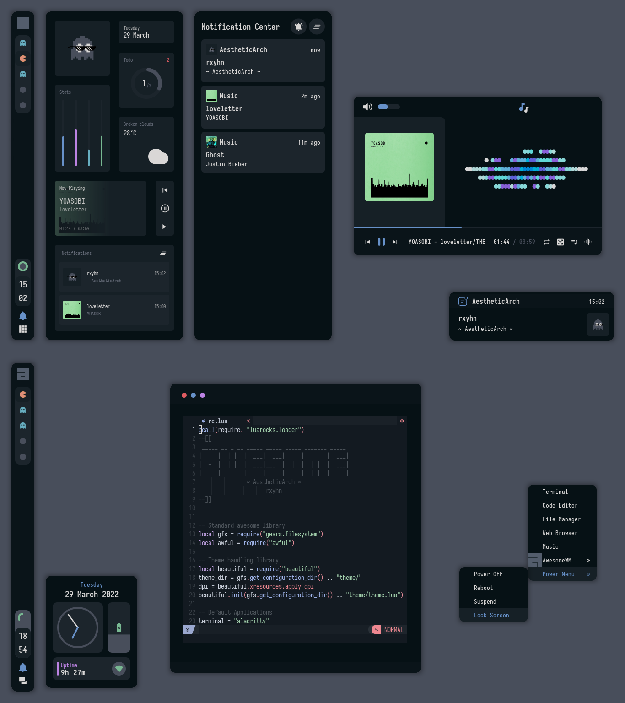

# Awesome-dotfiles

Config del tio S4vitar actualizada 24-10-2023

<!-- Screenshot -->
<div align="center">
    
</div>

<br>

<div align="center">
    
</div>

<br>
<br>

<a href="https://awesomewm.org/"></a>
<b> Aesthetic AwesomeWM Dotfiles </b>

Welcome to my AwesomeWM configuration files!

so yeah now i'm using awesomewm, looks like i'll be use this wm forever.

Because only this wm can satisfy me.

Fyi, I use night colorscheme, and it's so beautiful.

These dotfiles are made with love, for sure.

<h2></h2><br>

**Here are some details about my setup:**

| Programs   | Using           |
| ---------- | --------------- |
| WM         | awesome         |
| OS         | arch linux      |
| Terminal   | alacritty       |
| Shell      | zsh             |
| Editor     | neovim / vscode |
| Compositor | picom           |
| Launcher   | rofi            |

<h2></h2><br>

<details>
<summary><strong>S E T U P</strong></summary>

> This is step-by-step how to install these dotfiles. Just [R.T.F.M](https://en.wikipedia.org/wiki/RTFM).

1.  Install dependencies and enable services

    - Dependencies
      <a href="https://archlinux.org/"></a>

    * **Arch Linux** (and all Arch-based distributions)

          *Assuming your AUR helper is* `paru`

          ```shell
          paru -S awesome-git picom-git alacritty rofi todo-bin acpi acpid \
          wireless_tools jq inotify-tools polkit-gnome xdotool xclip maim \
          brightnessctl alsa-utils alsa-tools pulseaudio lm_sensors \
          mpd mpc mpdris2 ncmpcpp playerctl --needed
          ```

    - Services

      ```shell
      # For automatically launching mpd on login
      systemctl --user enable mpd.service
      systemctl --user start mpd.service

      # For charger plug/unplug events (if you have a battery)
      sudo systemctl enable acpid.service
      sudo systemctl start acpid.service
      ```

    - Softwares

      ```shell
      sudo pacman -S kitty firefox
      ```

2.  Install needed fonts

    You will need to install a few fonts (mainly icon fonts) in order for text and icons to be rendered properly.

    Necessary fonts:

    - **Iosevka** - [here](https://mega.nz/file/lMFyWZ7Y#j1T4HQfw-r4dI_QMazAQW4uhF_SiTBoQwCxzRNRjuCs)
    - **Icomoon** - [here](https://mega.nz/file/QZ0nwZ5Y#8hdmogeMH8yVzwtemxMuwLwDiWsf7-r-tfGV3XaJl-8)
    - **HackNerdFont** - [here](https://mega.nz/file/8EdQRBaR#cFPNQcHJfCKDx1KePSlf2kLE5uQnTNxqlvqj0FHSaZE)

    Once you download them and unpack them, place them into `~/.fonts` or `~/.local/share/fonts`.

    ```shell
    paru -S nerd-fonts-jetbrains-mono ttf-font-awesome ttf-awesome-4 ttf-material-desing-icons

    ```

3.  Install my AwesomeWM configuration files

    > Clone this repository

    ```shell
          mkdir /Desktop/repos
    cd $!
    git clone https://github.com/s3rv1/Awesome-dotfiles.git
    cd Awesome-dotfiles/dotfiles
    ```

    > Copy config and binaries files

    ```shell
    cp -r config/* ~/.config/
    cp -r bin/* ~/.local/bin/
    cp -r misc/. ~/
    ```

    > Feh installer

    ```shell
    sudo pacman -S feh
    ```

    > Recargar ' ctrl+win+r '

4.  Configure stuff

    The relevant files are inside your `~/.config/awesome` directory.

    - User preferences and default applications

      In `rc.lua` there is a _Default Applications_ section where user preferences and default applications are defined.
      You should change those to your liking.

      Note: For the weather widgets to work, you will also need to create an account on [openweathermap](https://openweathermap.org), get your key, look for your city ID, and set `openweathermap_key` and `openweathermap_city_id` accordingly.

5.  Lastly, log out from your current desktop session and log in into AwesomeWM.

</details>

<br>

<details>
<summary><strong>K E Y B I N D S</strong></summary>

I use <kbd>super</kbd> AKA Windows key as my main modifier.
also with <kbd>alt, shift, and ctrl</kbd>

**Keyboard**

| Keybind                          | Action                                               |
| -------------------------------- | ---------------------------------------------------- |
| <kbd>super + enter</kbd>         | Spawn terminal                                       |
| <kbd>super + f</kbd>             | Spawn web browser                                    |
| <kbd>super + x</kbd>             | Spawn color picker                                   |
| <kbd>super + a</kbd>             | Spawn file manager                                   |
| <kbd>super + d</kbd>             | Launch applications launcher                         |
| <kbd>super + shift + d</kbd>     | Toggle dashboard                                     |
| <kbd>super + q</kbd>             | Close client                                         |
| <kbd>super + ctrl + l</kbd>      | Toggle lock screen                                   |
| <kbd>super + [1-0]</kbd>         | View tag AKA change workspace (for you i3/bsp folks) |
| <kbd>super + shift + [1-0]</kbd> | Move focused client to tag                           |
| <kbd>super + space</kbd>         | Select next layout                                   |
| <kbd>super + s</kbd>             | Set tiling layout                                    |
| <kbd>super + shift + s</kbd>     | Set floating layout                                  |
| <kbd>super + c</kbd>             | Center floating client                               |
| <kbd>super + [arrow keys]</kbd>  | Change focus by direction                            |
| <kbd>super + shift + f</kbd>     | Toggle fullscreen                                    |
| <kbd>super + m</kbd>             | Toggle maximize                                      |
| <kbd>super + n</kbd>             | Minimize                                             |
| <kbd>ctrl + shift + n</kbd>      | Restore minimized                                    |
| <kbd>alt + tab</kbd>             | Window switcher                                      |

<br>

**Mouse on the desktop**

| Mousebind        | Action                    |
| ---------------- | ------------------------- |
| `left click`     | Dismiss all notifications |
| `right click`    | App drawer                |
| `middle click`   | Toggle Dashboard          |
| `scroll up/down` | Cycle through tags        |

_... And many many more! for more information check `awesome/configuration/keys.lua`_

</details>

<h2></h2><br>

**Acknowledgements**

- **Credits**

  - [ner0z](https://github.com/ner0z)

- **Special thanks to**
  - [ChocolateBread799](https://github.com/ChocolateBread799)
  - [JavaCafe01](https://github.com/JavaCafe01)

<h2></h2><br>

<p align="center"><a href="https://github.com/rxyhn/AwesomeWM-Dotfiles/blob/main/.github/LICENSE"></a></p>
